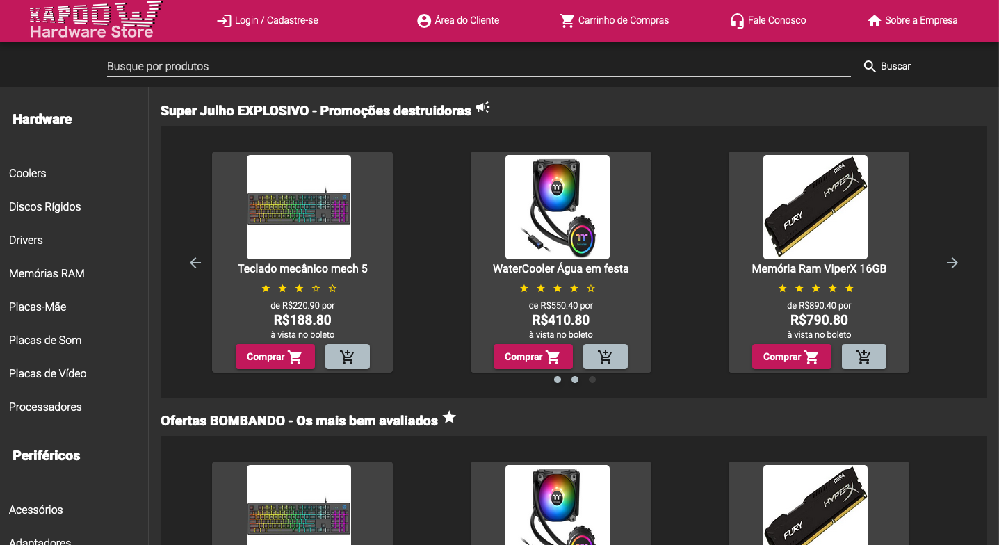
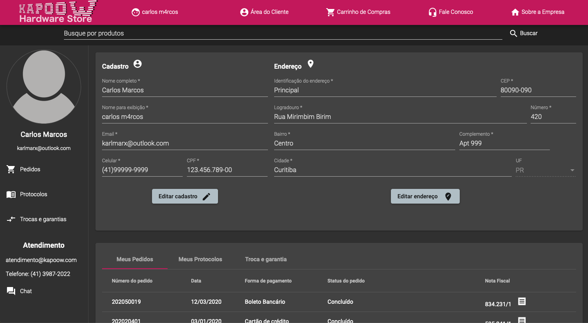
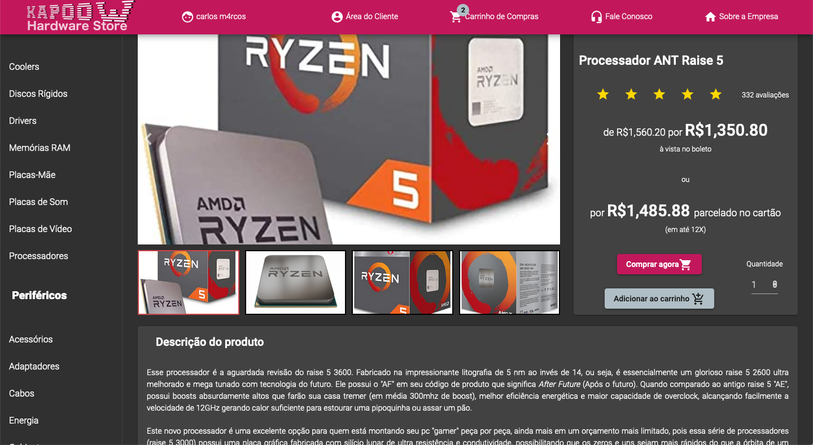
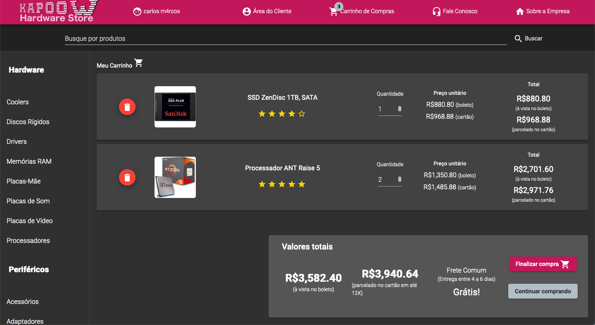
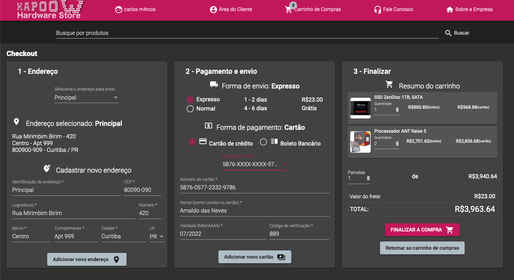
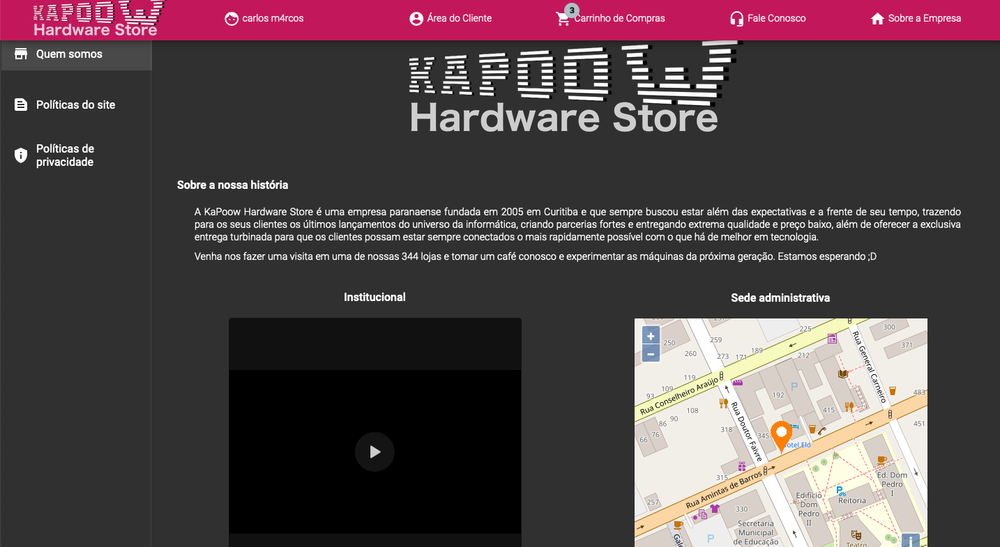

# KAPOOW HARDWARE STORE
---   
## Abstract   
This is an application made for the Human Computer Interaction class of the Systems Analysis and Development course. The idea is an interface project of an e-commerce of computer hardware parts, so this means there are no data persistence of any kind. Although there are some simple logics like a register and login system, a cart system, one page checkout and etc. It's important to keep in mind that everything will be lost in a browser refresh, for example.
This application was made in Angular 10 with Material Design.

## Overview
### Here are some screenshots of the application   
Main page
   

User area page

   
Product details page

   
Products cart page

   
One page checout page

   
About page

## A little more about it

### Motivation
This application was made as an requirement for the Human Computer Interaction class and to practice a little some frontend development using angular and material design

### Ingredients
The application was made in Angular 10, so it's necessary to have node and angular CLI installed. In addition, the Angular Material framework was used for styling.

### How to run in development mode
Install node and agular. After run `npm install` in the root folder to install all the dependencies. Then run `ng serve` in the root folder and the application will compile and be served in localhost port 4200. So Open [http://localhost:4200](http://localhost:4200) to view it in the browser.

### That's it?   
Yep! That's it! Super simple.

## Disclaimer
This project was made in colaboration with [André Antunes](https://github.com/andrekantunes).This is only for study purposes. :)